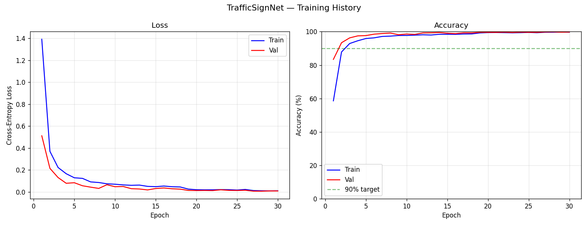

# Traffic Sign Classification — GTSRB

A custom CNN trained from scratch in PyTorch to classify German traffic signs.  
Achieved **97.18% accuracy** on the official GTSRB test benchmark across 43 classes.

---

## Results

| Metric | Value |
|---|---|
| Dataset | GTSRB (German Traffic Sign Recognition Benchmark) |
| Total images | 51,839 |
| Classes | 43 |
| Test Accuracy | **97.18%** |
| Training time | 22 minutes (CPU only) |
| Framework | PyTorch |



---

## Model Architecture — TrafficSignNet

Custom 3-block CNN built from scratch:

```
Input [3 × 32 × 32]
  → Conv Block 1: Conv2d(3→32)   + BatchNorm + ReLU + MaxPool → [32 × 16 × 16]
  → Conv Block 2: Conv2d(32→64)  + BatchNorm + ReLU + MaxPool → [64 × 8 × 8]
  → Conv Block 3: Conv2d(64→128) + BatchNorm + ReLU + MaxPool → [128 × 4 × 4]
  → Flatten → Dropout(0.5) → FC(2048→512) → FC(512→43)
```

**Trainable parameters:** 1,164,843

---

## Setup

```bash
git clone https://github.com/shaikaltaaf123/traffic-sign-classifier.git
cd traffic-sign-classifier

python -m venv venv
venv\Scripts\activate

pip install -r requirements.txt
```

---

## Train

```bash
python main.py
```

Downloads GTSRB automatically (~280MB). Trains for 30 epochs.  
Best model saved to `models/best_model.pth`.

---

## Inference

```bash
python inference.py --image path\to\your\image.jpg
```

Example output:
```
  Prediction : No trucks
  Confidence : 100.0%
```

---

## Key Design Decisions

- **From-scratch CNN** — not a pretrained ResNet, to demonstrate architecture understanding
- **Batch Normalisation** — stabilises training, acts as implicit regulariser
- **Dropout (0.5)** — prevents co-adaptation of neurons, reduces overfitting
- **No horizontal flip augmentation** — mirroring a speed limit sign changes its meaning
- **Val-based checkpointing** — saves best generalising model, not final epoch
- **Confusion matrix analysis** — safety-critical classes (Stop, No Entry) achieved perfect recall

---

## Dataset

J. Stallkamp et al., *Man vs. Computer: Benchmarking Machine Learning Algorithms  
for Traffic Sign Recognition*, Neural Networks, 2012.